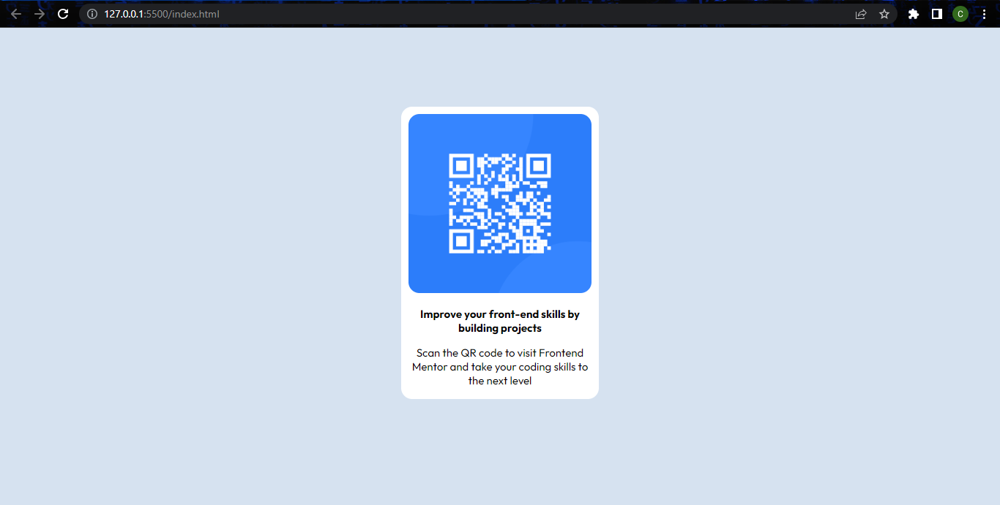

# Frontend Mentor - QR code component solution

This is a solution to the [QR code component challenge on Frontend Mentor](https://www.frontendmentor.io/challenges/qr-code-component-iux_sIO_H). Frontend Mentor challenges help you improve your coding skills by building realistic projects. 

## Table of contents

- [Overview](#overview)
  - [Screenshot](#screenshot)
  - [Links](#links)
- [My process](#my-process)
  - [Built with](#built-with)
  - [What I learned](#what-i-learned)
  - [Continued development](#continued-development)
- [Author](#author)
- [Acknowledgments](#acknowledgments)

## Overview

### Screenshot




### Links

- Solution URL: [Github](https://github.com/calvincec/QRcodeChallenge)

## My process

### Built with

- Semantic HTML5 markup
- CSS custom properties


### What I learned

Use this section to recap over some of your major learnings while working through this project. Writing these out and providing code samples of areas you want to highlight is a great way to reinforce your own knowledge.

To see how you can add code snippets, see below:

```html
<p>How I wrote a simple paragraph</p>
```
```css
.fist_separate_styling {
  color: red;
}
```


### Continued development

I now need to understand some css framework like bootstrap to ease the styling

I also need to work on my javascript skills to make it more responsive

I also need to deepen my knowledge of the newly learnt CSS and HTML


## Author

- [Website](https://www.linkedin.com/in/chacha-calvince-ndemo-7b7a2b240/)
- [Frontend Mentor](https://www.frontendmentor.io/profile/yourusername)
- [Twitter](https://twitter.com/calvince_n)

## Acknowledgments
I really thank The [Jitu company](https://thejitu.com) team and staff for equipping me with the entire knowledge

My special appreciation to my [Learning tutor](https://github.com/kithekadk) who is one of the staff at the giant tech company


